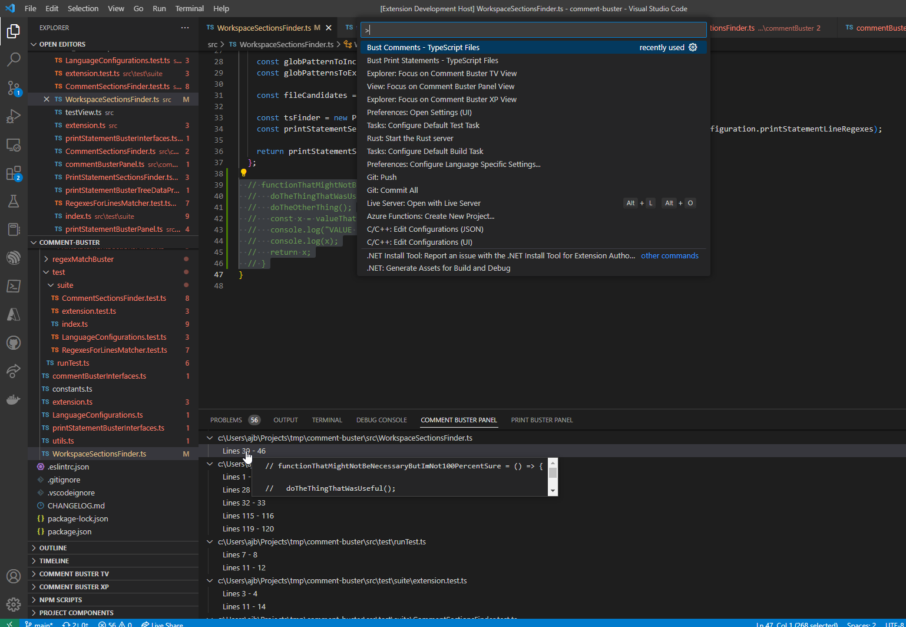

# Comment-buster
Comment-buster is a VS Code extension that searches through code files for chunks of commented out code and extraneous print statements (per language I use - TypeScript, Python, or C/C++). It then shows a report panel with those sections called out. This way, you can delete those lines so you don't end up with layers of commented out sections and extraneous print statements when you do a dev commit to park your work. Next time, you can start leaving a fresh mess!

## Get Started
* Install the extension (download from here).
* Bring up the VS Code Command Palette (Ctrl+Shift+P on Windows) and choose to `Bust` comments or print statements.
* Use the `Comment Buster Panel` and `Print Buster Panel` to find sections to clean up.
* Clean up, save your files, and rinse/repeat until you're good to park your work.

## How I Use Comment-Buster

Comment-buster supports the hack and slash way I could when prototyping, hacking around an unfamiliar repo, or coming back to a repo I had been working on a few months before. 

Regardless of how I start or get back into a project, I tend to liberally copy/paste chunks of code and comment out large swaths (even whole files) while reviewing and re-learning and discovering what is safe to delete. If these code bases were only a few files big, it wouldn't be too hard to clean up after that. However, I tend to like to have lots of small/medium-ish sized files and evolve my logic/methods side-by-side with the previous on-filesystem version. And so on, until I'm at a decent parking point for my progress.

This is where cleaning up becomes a nuisance. I'm pretty good with where the current logic is. I want to quickly clean up and commit. So I need to find the chunks I commented out across my codebase and the print statements I've left littered while working through/rebuilding my knowledge. Which is why I created Comment-buster. Find those chunks of commented out code and extraneous print statements and quickly navigate to them. You can delete those lines and sections so you don't end up with layers of commented out sections and extraneous print statements. 

Next time, clean up after yourself quickly so you can leave a fresh mess!

## In Action

## Known Issues

...

## Release Notes

### 1.0.0

Initial release of Comment-buster

**Enjoy!**
